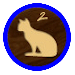

# Dou Shou Qi - SDL

 ESIEE I3 Rioc Project by Gabin Legrand and Dorian Lamour

**To Do list**

* Water Check - Values priority
* Improve GUI code
* Add an IA with tree intelligence
* Add online mode

**Folders :**

* assets-> images
* include-> header files
* obj-> object files
* src-> source codes and makefile

**What is needed to run :**

* C++
* g++
* make (For makefile)
* SDL2
* SDL2-IMAGE