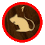
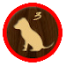
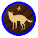
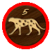

# Dou Shou Qi - SDL

 ESIEE I3 Rioc Project by Gabin Legrand and Dorian Lamour

**To Do list**

* Traps + Can't go on his base
* Change / Improve Graphics
* Winning condition
* Save and Resume a game
* _Add an IA with tree intelligence with many levels_
* _Add online mode_
* _Improve GUI code_

**Folders :**

* assets-> images
* include-> header files
* obj-> object files
* src-> source codes and makefile

**What is needed to run :**

* C++
* g++
* make (For makefile)
* SDL2
* SDL2-IMAGE